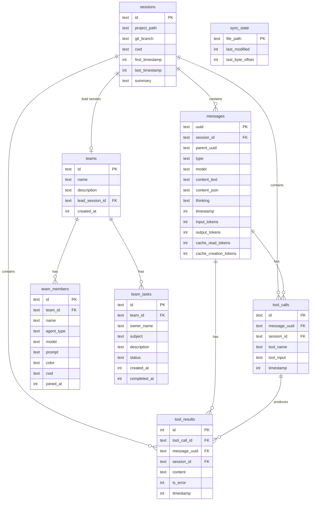

# ccrecall

Sync Claude Code transcripts to SQLite for analytics.

## Install

### Binary (recommended)

| File                                                                                                                  | Platform                  |
| --------------------------------------------------------------------------------------------------------------------- | ------------------------- |
| [`ccrecall-linux-x64`](https://github.com/spences10/ccrecall/releases/latest/download/ccrecall-linux-x64)             | Linux (Intel/AMD)         |
| [`ccrecall-linux-arm64`](https://github.com/spences10/ccrecall/releases/latest/download/ccrecall-linux-arm64)         | Linux (ARM, Raspberry Pi) |
| [`ccrecall-darwin-x64`](https://github.com/spences10/ccrecall/releases/latest/download/ccrecall-darwin-x64)           | macOS (Intel)             |
| [`ccrecall-darwin-arm64`](https://github.com/spences10/ccrecall/releases/latest/download/ccrecall-darwin-arm64)       | macOS (Apple Silicon)     |
| [`ccrecall-windows-x64.exe`](https://github.com/spences10/ccrecall/releases/latest/download/ccrecall-windows-x64.exe) | Windows                   |

Or use curl:

```bash
# Linux (x64)
curl -fsSL https://github.com/spences10/ccrecall/releases/latest/download/ccrecall-linux-x64 -o ~/.local/bin/ccrecall && chmod +x ~/.local/bin/ccrecall

# Linux (arm64)
curl -fsSL https://github.com/spences10/ccrecall/releases/latest/download/ccrecall-linux-arm64 -o ~/.local/bin/ccrecall && chmod +x ~/.local/bin/ccrecall

# macOS (Apple Silicon)
curl -fsSL https://github.com/spences10/ccrecall/releases/latest/download/ccrecall-darwin-arm64 -o /usr/local/bin/ccrecall && chmod +x /usr/local/bin/ccrecall

# macOS (Intel)
curl -fsSL https://github.com/spences10/ccrecall/releases/latest/download/ccrecall-darwin-x64 -o /usr/local/bin/ccrecall && chmod +x /usr/local/bin/ccrecall
```

### From source

Requires [Bun](https://bun.sh) >= 1.0:

```bash
git clone https://github.com/spences10/ccrecall.git
cd ccrecall
bun install
bun src/index.ts sync
```

## Usage

```bash
# Sync transcripts from ~/.claude/projects to SQLite
ccrecall sync

# Show stats
ccrecall stats

# Help
ccrecall --help
```

### From source

```bash
bun src/index.ts sync
bun src/index.ts stats
```

### Commands

| Command | Description                                |
| ------- | ------------------------------------------ |
| `sync`  | Import transcripts and teams (incremental) |
| `stats` | Show session/message/team/token counts     |

### Options

| Flag              | Description                                             |
| ----------------- | ------------------------------------------------------- |
| `-v, --verbose`   | Show files being processed                              |
| `-d, --db <path>` | Custom database path (default: `~/.claude/ccrecall.db`) |

## Database Schema



### Team/Swarm Support

Syncs team data from `~/.claude/teams/` when Claude Code's swarm mode
is enabled.

**Why track teams?**

- Debug runaway agents: compare `prompt` (original instructions) vs
  actual behavior
- Link swarm runs to sessions and PRs
- Track task assignments and completion

## Example Queries

```sql
-- Token usage by project
SELECT project_path, SUM(input_tokens + output_tokens) as tokens
FROM sessions s
JOIN messages m ON m.session_id = s.id
GROUP BY project_path
ORDER BY tokens DESC;

-- Daily message count
SELECT DATE(timestamp/1000, 'unixepoch') as day, COUNT(*) as messages
FROM messages
GROUP BY day
ORDER BY day DESC;

-- Most used models
SELECT model, COUNT(*) as count
FROM messages
WHERE model IS NOT NULL
GROUP BY model
ORDER BY count DESC;

-- Tool usage breakdown
SELECT tool_name, COUNT(*) as count
FROM tool_calls
GROUP BY tool_name
ORDER BY count DESC;

-- Files read in a session
SELECT tc.tool_name, json_extract(tc.tool_input, '$.file_path') as file
FROM tool_calls tc
WHERE tc.tool_name = 'Read' AND tc.session_id = 'your-session-id';

-- Code changes (edits) with before/after
SELECT
  json_extract(tc.tool_input, '$.file_path') as file,
  json_extract(tc.tool_input, '$.old_string') as old,
  json_extract(tc.tool_input, '$.new_string') as new
FROM tool_calls tc
WHERE tc.tool_name = 'Edit';

-- Session cost estimate (Opus 4.5)
SELECT
  s.project_path,
  SUM(m.input_tokens) / 1000000.0 * 15 +
  SUM(m.output_tokens) / 1000000.0 * 75 +
  SUM(m.cache_read_tokens) / 1000000.0 * 1.5 +
  SUM(m.cache_creation_tokens) / 1000000.0 * 18.75 as cost_usd
FROM sessions s
JOIN messages m ON m.session_id = s.id
WHERE m.model LIKE '%opus%'
GROUP BY s.id
ORDER BY cost_usd DESC;

-- Teams with member count
SELECT t.name, t.description, COUNT(tm.id) as members
FROM teams t
LEFT JOIN team_members tm ON tm.team_id = t.id
GROUP BY t.id;

-- Agent prompts for debugging (what were they told to do?)
SELECT name, prompt FROM team_members WHERE team_id = 'your-team-id';

-- Task status by team
SELECT team_id, status, COUNT(*) as count
FROM team_tasks
GROUP BY team_id, status;

-- Link Teammate tool calls to team configs
SELECT tc.timestamp, t.name, t.description
FROM tool_calls tc
JOIN teams t ON json_extract(tc.tool_input, '$.team_name') = t.name
WHERE tc.tool_name = 'Teammate';
```

## License

MIT
